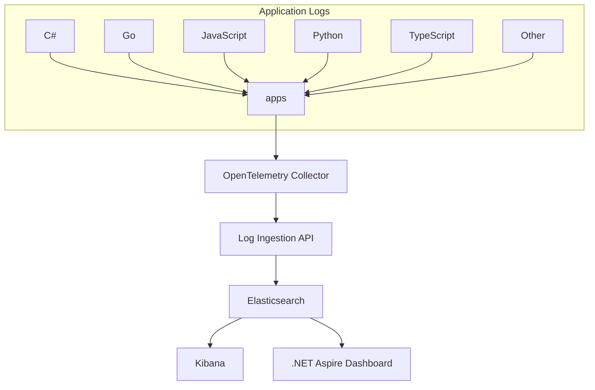

# Loggle

Loggle is a self-hosted log monitoring solution that stitches together the best available tools for log management. If you're looking to take control of your logs without relying on third-party services, Loggle is for you. This is a fun project intended for experimentation and learning, and it is not recommended for production use.

## Quick Start - Local Development

Before diving into cloud deployment, try Loggle locally:

1. **Prerequisites:**
   - Docker Desktop installed and running
   - Visual Studio or VS Code with .NET SDK

2. **Run with Docker:**
   ```powershell
   cd examples
   .\loggle-compose.ps1 start   # Starts all required containers
   ```
   This will provision:
   - Elasticsearch
   - Kibana
   - .NET Aspire Dashboard
   - OpenTelemetry Collector
   - Loggle.Web

3. **Run the Example App:**
   - Open `Loggle.sln` in Visual Studio
   - Set `Examples.Loggle.Console` as startup project
   - Run the application (F5)

4. **View Your Logs:**
   - Open [Kibana Log Explorer](http://localhost:5601/app/observability-logs-explorer/)
   - Open [.NET Aspire Dashboard](http://localhost:18888/) for an Aspire-first log browsing experience
   - Watch your logs flow in real-time

5. **Cleanup:**
   ```powershell
   .\loggle-compose.ps1 stop    # Stops and removes all containers
   ```

### Quick .NET integration

If you're already instrumenting applications with .NET, wiring Loggle into your existing logging pipeline takes just a couple of minutes:

0. **Add the NuGet package**
   ```powershell
   dotnet add package Loggle
   ```
   Or with the Package Manager Console:
   ```powershell
   Install-Package Loggle
   ```
   This brings in the `AddLoggleExporter()` extension method used below.

1. **Add configuration to `appsettings.json`:**
   ```json
   {
     "Logging": {
       "OpenTelemetry": {
         "IncludeFormattedMessage": true,
         "IncludeScopes": true,
         "ParseStateValues": true
       },
       "Loggle": {
         "ServiceName": "Examples.Loggle.Console",
         "ServiceVersion": "v0.99.5-rc.7",
         "OtelCollector": {
           "BearerToken": "REPLACE_WITH_YOUR_OWN_SECRET",
           "LogsReceiverEndpoint": "http://your-domain-or-ip:4318/v1/logs"
         }
       }
     }
   }
   ```

2. **Register the Loggle exporter in `Program.cs`:**
   ```csharp
   var builder = Host.CreateDefaultBuilder(args)
     .ConfigureServices((hostContext, services) =>
     {
       // Register the Loggle exporter
       services.AddLoggleExporter();
     });
   ```

That’s it—run your app and the logs stream straight into Loggle alongside the rest of your stack.

### Multilingual logging samples

The `examples` folder contains OpenTelemetry logging snippets for .NET, Python, JavaScript, TypeScript, and Go. Run any combination from PowerShell:

```powershell
cd examples
.\run-examples.ps1 -Language python
# The script keeps running until you press Ctrl+C.
```

Each sample now ships with its own configuration (`config.json`, `.env`, or `appsettings.json`). Adjust those files to point at your collector or change service metadata. The runner simply installs per-language dependencies (for example `pip install` or `npm install --legacy-peer-deps`) and loops the program until you stop it.

## .NET Aspire Dashboard

When you run the local Docker stack, Loggle ships a self-contained `.NET Aspire` dashboard that reads directly from the same Elasticsearch data stream as Kibana.
- Access the dashboard UI at `http://localhost:18888/` (default local setup does not require authentication).
- Ports `18889` and `18890` stay exposed for OTLP and gRPC endpoints, matching Aspire defaults.
- Update `examples/aspire-dashboard/appsettings.Development.json` if you need the dashboard to target a different Elasticsearch host or data stream.
- ⚠️ **Experimental integration:** the current Aspire dashboard work is a persistence experiment. Active development happens in the fork at [jgador/loggle_aspire](https://github.com/jgador/loggle_aspire), where the Aspire-specific updates will continue to evolve.

## Video Tutorial

Watch this short video on Google Drive for a walkthrough of setting up and using Loggle:  
[](https://drive.google.com/file/d/1uOmeeH3Hq63jPdic1IZwZl8jC4rPobLj/view?usp=drive_link)

This video provides a concise overview of deploying Loggle, configuring log forwarding, and accessing Kibana for log visualization.

## What It Does

- **Self-Hosted Monitoring:** Manage your logs on your own server.
- **Complete Toolset:**  
  - **OpenTelemetry Collector:** Collects your logs.
  - **Elasticsearch:** Stores your logs.  
  - **Kibana:** Visualizes your logs.  
  - **.NET Aspire Dashboard:** Offers an Aspire-native observability view backed by Elasticsearch.
- **Easy Deployment:**  
  - Provision a virtual machine with Terraform on Azure (support for AWS and GCP coming soon).  
  - Automatically obtain and renew SSL/TLS certificates using Certbot with Let's Encrypt.
- **Simple Setup:** Provision your VM, send your logs, and access them in Kibana.

## Data Flow

Your applications forward their logs to the OpenTelemetry Collector, which exports them to the Log Ingestion API. The Log Ingestion API processes the data and stores it in Elasticsearch, from where Kibana pulls the data for visualization.



## Cloud deployment - Azure (ARM templates)

Loggle now ships an Azure Resource Manager template as the primary way to deploy the stack in Azure. The template lives at `azure/arm/loggle.json` (authored in `azure/arm/loggle.bicep`) and already contains every parameter definition—no separate `parameters.json` file is required. The VM bootstrapper pulls the assets that live under `azure/vm-assets`, runs `install.sh`, and configures the containers automatically.

### Prerequisites
- Azure subscription with Contributor rights to the destination resource group.
- Azure CLI 2.61+ (optional if you use only the Portal) and the **Template deployment** blade enabled.
- Ability to create a Standard static public IP in your chosen region.
- SSH key pair (public key in OpenSSH format) dedicated to this VM.
- DNS control for the hostname you will map to Loggle (`kibana.loggle.co` by default).
- Outbound access to `github.com` from the VM so it can fetch `install.sh` and the asset bundle.

### Step 1. Clone the repo and review template parameters
```pwsh
git clone https://github.com/jgador/loggle.git
cd loggle
```
Open `azure/arm/loggle.json` and adjust any default values you want to bake in before sharing the file. You can also leave the defaults untouched and provide overrides during deployment. Key parameters to review:

| Parameter | Purpose | Default |
|-----------|---------|---------|
| `namePrefix` | Prefix applied to every Azure resource name. | `loggle` |
| `sshPublicKey` | **Required** public key that unlocks SSH. | *(none)* |
| `domainName` | FQDN served by the stack and used for TLS. | `kibana.loggle.co` |
| `certificateEmail` | LetsEncrypt contact email. | `certbot@loggle.co` |
| `kibanaAllowedIps` | Array of IPv4 CIDR blocks allowed to reach Kibana (443). | `["0.0.0.0/0"]` |
| `publicIpName` | **Required** name of the pre-created static public IP in your resource group. | *(none)* |
| `letsEncryptEnvironment` | `production` for real certs, `staging` for repeated dry-runs. | `production` |

> Tip: if you want to source the template directly from GitHub, use the raw URL `https://raw.githubusercontent.com/jgador/loggle/<branch>/azure/arm/loggle.json`.

### Step 2. Prepare the resource group and static IP
- Create (or select) a resource group in the Azure region you want to run Loggle.
- Provision a Standard static public IP inside that group. The ARM template only attaches to an existing IP so this step is required.
- Record the IP resource name; you will pass it as `publicIpName`.

```pwsh
az group create --name loggle-rg --location eastus
az network public-ip create `
  --resource-group loggle-rg `
  --name loggle-ip `
  --sku Standard `
  --allocation-method Static
```


### Step 3. Deploy with the Azure Portal (recommended)
1. In the Azure Portal, search for **Deploy a custom template**.
2. Choose your subscription and resource group, then select **Build your own template in the editor**.
3. Paste the contents of `azure/arm/loggle.json` or upload the file directly.
4. Fill in the parameters—make sure `sshPublicKey`, `publicIpName`, `domainName`, and `kibanaAllowedIps` reflect your environment.
5. Validate, then press **Review + create** to kick off the deployment.


When the deployment completes you will see outputs for the VM public IP, managed identity client ID, and Key Vault resource ID.

### Step 4. Deploy with Azure CLI (automated option)
If you prefer scripting or CI/CD, run the same template with `az deployment group create`:

```pwsh
$sshKey = Get-Content $env:USERPROFILE/.ssh/loggle.pub -Raw
az deployment group create `
  --resource-group loggle-rg `
  --name loggle-arm `
  --template-file azure/arm/loggle.json `
  --parameters `
    sshPublicKey="$sshKey" `
    publicIpName="loggle-ip" `
    domainName="logs.contoso.com" `
    kibanaAllowedIps="['203.0.113.24/32']"
```

Azure CLI accepts array parameters as JSON strings (note the single quotes inside the double-quoted argument). Add more overrides as needed; every parameter from the table can be passed on the command line.

### Step 5. Monitor the VM bootstrap
- After deployment, open the VM -> **Run command** -> **RunShellScript**, then inspect `/etc/loggle/install.log`.
- Alternatively, use Azure CLI:  
  `az vm run-command invoke -g loggle-rg -n loggle-vm --command-id RunShellScript --scripts "sudo tail -n 50 /etc/loggle/install.log"`
- Wait for `Loggle setup complete` along with the container status summary before inviting traffic.


### Step 6. Wire up DNS and verify endpoints
- Point your chosen hostname (e.g., `logs.contoso.com`) at the static public IP using an **A** record with a low TTL while testing.
- Update `kibanaAllowedIps` to restrict access to trusted admin IPs; redeploy the template if you need to tighten the NSG later.
- Browse to `https://<domain>` for Kibana and `http://<domain>:4318/v1/logs` for the OTLP collector after the certificates finish provisioning (can take a few minutes).
- Keep the `azure/arm/loggle.json` file under version control—every update to your infra defaults should be reviewed just like application code.

Need to customize or extend the deployment further? Modify `azure/arm/loggle.bicep`, regenerate `azure/arm/loggle.json` with `az bicep build`, and redeploy.

## Legacy Terraform deployment (advanced)
> **Heads up:** Terraform remains in `terraform/azure` for teams that prefer IaC modules or already have automation built around it. The ARM template described above is the recommended path for new deployments.
> **Prerequisite:**  
> Ensure you have Terraform with Azure CLI working. For more information, refer to [this guide](https://learn.microsoft.com/en-us/azure/developer/terraform/get-started-windows-bash).

> **Important Note:** The SSL certificate generation is currently hardcoded to use "kibana.loggle.co". Since you'll be using your own domain, you'll need to manually update the deployment scripts to reflect that. This will be made configurable in future updates.

1. **Generate an SSH Key:**  
   The SSH key will be used to authenticate your virtual machine.  
   If you're using PowerShell, run:
    ```powershell
    ssh-keygen -t rsa -b 4096 -C "loggle" -f "$env:USERPROFILE\.ssh\loggle" -N ""
    ```

2. **Clone the Repository:**  
    ```bash
    git clone https://github.com/jgador/loggle
    cd terraform\azure
    ```

   > **Multiple Azure subscriptions?**  
   > List your available subscriptions and set the one Terraform should use:
   > ```bash
   > az account list -o table
   > az account set --subscription "<subscription name or id>"
   > ```
   > Replace the placeholder with the subscription you want to target before running any Terraform commands.

3. **Provision the Public IP:**  
    This will allocate a public IP for your VM.
    ```bash
    terraform apply -target="azurerm_public_ip.public_ip" -auto-approve
    ```

4. **Update Your Domain Registrar:**  
    Configure your domain's DNS settings by adding an **A record** that points to your public IP address with a TTL of 600 seconds. For example, in GoDaddy, go to your domain's DNS management panel, create a new **A** record with the host set to "@" (or your preferred subdomain), enter your public IP address, and set the TTL to 600.

5. **Deploy with Terraform:**  
    This step deploys all the necessary resources including the resource group, virtual network, subnet, public IP, network security group, network interface, and the virtual machine.
    ```bash
    terraform apply -auto-approve
    ```
    > **Note:** If you rebuild the VM while reusing the same static public IP, clear the old SSH host fingerprint before reconnecting:
    > ```powershell
    > ssh-keygen -R 52.230.2.122
    > ```
    > Replace the IP if you change it. This prevents host key warnings when you SSH back in.
    > Kibana is locked down to a default allow list. Update `kibana_allowed_ips` in `terraform/azure/variables.tf` (or override via `terraform.tfvars`) with your own public IPs before applying if `34.126.86.243` is not yours.

### Re-run the provisioning script inside the VM

The VM stores the managed identity in `/etc/loggle/identity.env`, so `/etc/loggle/install.sh` can be run repeatedly without additional parameters. After SSH-ing into the host:

```bash
sudo /bin/bash /etc/loggle/install.sh
```

This replays package installs, certificate sync, and service configuration in an idempotent manner.

6. **Send Your Logs:**  
    Configure your application to forward logs using the following steps:
    1. Add configuration to `appsettings.json`:
    ```json
    {
      "Logging": {
        "OpenTelemetry": {
          "IncludeFormattedMessage": true,
          "IncludeScopes": true,
          "ParseStateValues": true
        },
        "Loggle": {
          "ServiceName": "Examples.Loggle.Console",
          "ServiceVersion": "v0.99.5-rc.7",
          "OtelCollector": {
            "BearerToken": "REPLACE_WITH_YOUR_OWN_SECRET",
            "LogsReceiverEndpoint": "http://your-domain-or-ip:4318/v1/logs"
          }
        }
      }
    }
    ```
    2. Add the Loggle exporter in your `Program.cs`:
    ```csharp
    var builder = Host.CreateDefaultBuilder(args)
      .ConfigureServices((hostContext, services) =>
      {
        // Register the loggle exporter
        services.AddLoggleExporter();
      });
    ```


7. **Access Kibana:**  
    Kibana is automatically set up as part of the deployment and exposed on standard HTTPS. Open your browser and navigate to `https://kibana.loggle.co` (replace with your domain) to view your logs. Remember: the OpenTelemetry Collector listens on port **4318** and Kibana is now published on port **443**.

8. **Tear Down (Optional):**  
    A helper script keeps the resource group and static public IP while destroying everything else:
    ```powershell
    pwsh .\destroy.ps1          # Use -AutoApprove:$false if you want to confirm the destroy
    ```
    Run it from `terraform\azure`. The wrapper builds a `terraform destroy` call that targets every managed resource except the protected resource group, public IP, and Key Vault, so those stay in place while the rest is removed.

## For older versions, see:

- [README for v0.99.5-rc8](./docs/legacy/README-v0.99.5-rc8.md)
