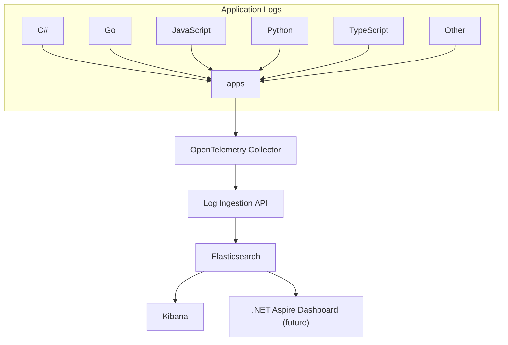

# Loggle

Loggle is a self-hosted log monitoring solution that stitches together the best available tools for log management. If you're looking to take control of your logs without relying on third-party services, Loggle is for you. This is a fun project intended for experimentation and learning, and it is not recommended for production use.

## Quick Start - Local Development

Before diving into cloud deployment, try Loggle locally:

1. **Prerequisites:**
   - Docker Desktop installed and running
   - Visual Studio or VS Code with .NET SDK

2. **Run with Docker:**
   ```powershell
   cd examples
   .\loggle-compose.ps1 start   # Starts all required containers
   ```
   This will provision:
   - Elasticsearch
   - Kibana
   - OpenTelemetry Collector
   - Loggle.Web

3. **Run the Example App:**
   - Open `Loggle.sln` in Visual Studio
   - Set `Examples.Loggle.Console` as startup project
   - Run the application (F5)

4. **View Your Logs:**
   - Open [Kibana Log Explorer](http://localhost:5601/app/observability-logs-explorer/)
   - Watch your logs flow in real-time

5. **Cleanup:**
   ```powershell
   .\loggle-compose.ps1 stop    # Stops and removes all containers
   ```

### Multilingual logging samples

The `examples` folder contains OpenTelemetry logging snippets for .NET, Python, JavaScript, TypeScript, and Go. Run any combination from PowerShell:

```powershell
cd examples
.\run-examples.ps1 -Language python
# The script keeps running until you press Ctrl+C.
```

Each sample now ships with its own configuration (`config.json`, `.env`, or `appsettings.json`). Adjust those files to point at your collector or change service metadata. The runner simply installs per-language dependencies (for example `pip install` or `npm install --legacy-peer-deps`) and loops the program until you stop it.

## Video Tutorial

Watch this short video on Google Drive for a walkthrough of setting up and using Loggle:  
[](https://drive.google.com/file/d/1uOmeeH3Hq63jPdic1IZwZl8jC4rPobLj/view?usp=drive_link)

This video provides a concise overview of deploying Loggle, configuring log forwarding, and accessing Kibana for log visualization.

## What It Does

- **Self-Hosted Monitoring:** Manage your logs on your own server.
- **Complete Toolset:**  
  - **OpenTelemetry Collector:** Collects your logs.  
  - **Elasticsearch:** Stores your logs.  
  - **Kibana:** Visualizes your logs.
- **Easy Deployment:**  
  - Provision a virtual machine with Terraform on Azure (support for AWS and GCP coming soon).  
  - Automatically obtain and renew SSL/TLS certificates using Certbot with Let's Encrypt.
- **Simple Setup:** Provision your VM, send your logs, and access them in Kibana.

## Data Flow

Your applications forward their logs to the OpenTelemetry Collector, which exports them to the Log Ingestion API. The Log Ingestion API processes the data and stores it in Elasticsearch, from where Kibana pulls the data for visualization.



## Cloud Deployment Guide
> **Prerequisite:**  
> Ensure you have Terraform with Azure CLI working. For more information, refer to [this guide](https://learn.microsoft.com/en-us/azure/developer/terraform/get-started-windows-bash).

> **Important Note:** The SSL certificate generation is currently hardcoded to use "kibana.loggle.co". Since you'll be using your own domain, you'll need to manually update the deployment scripts to reflect that. This will be made configurable in future updates.

1. **Generate an SSH Key:**  
   The SSH key will be used to authenticate your virtual machine.  
   If you're using PowerShell, run:
    ```powershell
    ssh-keygen -t rsa -b 4096 -C "loggle" -f "$env:USERPROFILE\.ssh\loggle" -N ""
    ```

2. **Clone the Repository:**  
    ```bash
    git clone https://github.com/jgador/loggle
    cd terraform\azure
    ```

   > **Multiple Azure subscriptions?**  
   > List your available subscriptions and set the one Terraform should use:
   > ```bash
   > az account list -o table
   > az account set --subscription "<subscription name or id>"
   > ```
   > Replace the placeholder with the subscription you want to target before running any Terraform commands.

3. **Provision the Public IP:**  
    This will allocate a public IP for your VM.
    ```bash
    terraform apply -target="azurerm_public_ip.public_ip" -auto-approve
    ```

4. **Update Your Domain Registrar:**  
    Configure your domain's DNS settings by adding an **A record** that points to your public IP address with a TTL of 600 seconds. For example, in GoDaddy, go to your domain's DNS management panel, create a new **A** record with the host set to "@" (or your preferred subdomain), enter your public IP address, and set the TTL to 600.

5. **Deploy with Terraform:**  
    This step deploys all the necessary resources including the resource group, virtual network, subnet, public IP, network security group, network interface, and the virtual machine.
    ```bash
    terraform apply -auto-approve
    ```
    > **Note:** If you rebuild the VM while reusing the same static public IP, clear the old SSH host fingerprint before reconnecting:
    > ```powershell
    > ssh-keygen -R 52.230.2.122
    > ```
    > Replace the IP if you change it. This prevents host key warnings when you SSH back in.
    > Kibana is locked down to a default allow list. Update `kibana_allowed_ips` in `terraform/azure/variables.tf` (or override via `terraform.tfvars`) with your own public IPs before applying if `34.126.86.243` is not yours.

### Re-run the provisioning script inside the VM

The VM stores the managed identity in `/etc/loggle/identity.env`, so `/etc/loggle/setup.sh` can be run repeatedly without additional parameters. After SSH-ing into the host:

```bash
sudo /bin/bash /etc/loggle/setup.sh
```

This replays package installs, certificate sync, and service configuration in an idempotent manner.

6. **Send Your Logs:**  
    Configure your application to forward logs using the following steps:
    1. Add configuration to `appsettings.json`:
    ```json
    {
      "Logging": {
        "OpenTelemetry": {
          "IncludeFormattedMessage": true,
          "IncludeScopes": true,
          "ParseStateValues": true
        },
        "Loggle": {
          "ServiceName": "Examples.Loggle.Console",
          "ServiceVersion": "v0.99.5-rc.7",
          "OtelCollector": {
            "BearerToken": "REPLACE_WITH_YOUR_OWN_SECRET",
            "LogsReceiverEndpoint": "http://your-domain-or-ip:4318/v1/logs"
          }
        }
      }
    }
    ```
    2. Add the Loggle exporter in your `Program.cs`:
    ```csharp
    var builder = Host.CreateDefaultBuilder(args)
      .ConfigureServices((hostContext, services) =>
      {
        // Register the loggle exporter
        services.AddLoggleExporter();
      });
    ```


7. **Access Kibana:**  
    Kibana is automatically set up as part of the deployment and exposed on standard HTTPS. Open your browser and navigate to `https://kibana.loggle.co` (replace with your domain) to view your logs. Remember: the OpenTelemetry Collector listens on port **4318** and Kibana is now published on port **443**.

8. **Tear Down (Optional):**  
    A helper script keeps the resource group and static public IP while destroying everything else:
    ```powershell
    pwsh .\destroy.ps1          # Use -AutoApprove:$false if you want to confirm the destroy
    ```
    Run it from `terraform\azure`. The wrapper builds a `terraform destroy` call that targets every managed resource except the protected resource group, public IP, and Key Vault, so those stay in place while the rest is removed.
