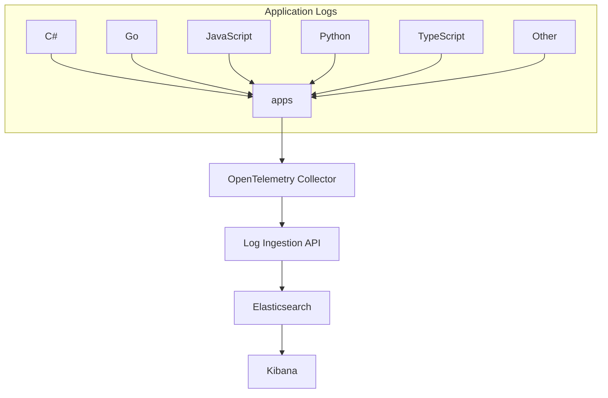

# Loggle

Loggle is a self-hosted log monitoring solution that stitches together the best available tools for log management. This README focuses on two things:
- **Run it locally in minutes** (Docker + sample apps) so you can see Kibana dashboards immediately.
- **Deploy it to Azure with ARM templates** once you’re satisfied with the local experience.

If you're looking to take control of your logs without relying on third-party services, Loggle is for you. This is a fun project intended for experimentation and learning, and it is not recommended for production use.

## Quick Start - Local Development

Before diving into cloud deployment, try Loggle locally:

1. **Prerequisites:**
   - Docker Desktop installed and running
   - Visual Studio or VS Code with .NET SDK

2. **Run with Docker:**
   ```powershell
   cd examples
   .\loggle-compose.ps1 start   # Starts all required containers
   ```
   This will provision:
   - Elasticsearch
   - Kibana
   - OpenTelemetry Collector
   - Loggle.Web

3. **Run the Example App:**
   - Open `Loggle.sln` in Visual Studio
   - Set `Examples.Loggle.Console` as startup project
   - Run the application (F5)

4. **View Your Logs:**
   - Open [Kibana Log Explorer](http://localhost:5601/app/observability-logs-explorer/)
   - Watch your logs flow in real-time

5. **Cleanup:**
   ```powershell
   .\loggle-compose.ps1 stop    # Stops and removes all containers
   ```

### Quick .NET integration

If you're already instrumenting applications with .NET, wiring Loggle into your existing logging pipeline takes just a couple of minutes:

0. **Add the NuGet package**
   ```powershell
   dotnet add package Loggle
   ```
   Or with the Package Manager Console:
   ```powershell
   Install-Package Loggle
   ```
   This brings in the `AddLoggleExporter()` extension method used below.

1. **Add configuration to `appsettings.json`:**
   ```json
   {
     "Logging": {
       "OpenTelemetry": {
         "IncludeFormattedMessage": true,
         "IncludeScopes": true,
         "ParseStateValues": true
       },
       "Loggle": {
         "ServiceName": "Examples.Loggle.Console",
         "ServiceVersion": "v0.99.5-rc.7",
         "OtelCollector": {
           "BearerToken": "REPLACE_WITH_YOUR_OWN_SECRET",
           "LogsReceiverEndpoint": "http://your-domain-or-ip:4318/v1/logs"
         }
       }
     }
   }
   ```

2. **Register the Loggle exporter in `Program.cs`:**
   ```csharp
   var builder = Host.CreateDefaultBuilder(args)
     .ConfigureServices((hostContext, services) =>
     {
       // Register the Loggle exporter
       services.AddLoggleExporter();
     });
   ```

That’s it—run your app and the logs stream straight into Loggle alongside the rest of your stack.

### Multilingual logging samples

The `examples` folder contains OpenTelemetry logging snippets for .NET, Python, JavaScript, TypeScript, and Go. Run any combination from PowerShell:

```powershell
cd examples
.\run-examples.ps1 -Language python
# The script keeps running until you press Ctrl+C.
```

Each sample now ships with its own configuration (`config.json`, `.env`, or `appsettings.json`). Adjust those files to point at your collector or change service metadata. The runner simply installs per-language dependencies (for example `pip install` or `npm install --legacy-peer-deps`) and loops the program until you stop it.

## What It Does

- **Self-Hosted Monitoring:** Manage your logs on your own server.
- **Complete Toolset:**  
  - **OpenTelemetry Collector:** Collects your logs.
  - **Elasticsearch:** Stores your logs.  
  - **Kibana:** Visualizes your logs.  
- **Easy Deployment:**  
  - Provision a virtual machine with Terraform on Azure (support for AWS and GCP coming soon).  
  - Automatically obtain and renew SSL/TLS certificates using Certbot with Let's Encrypt.
- **Simple Setup:** Provision your VM, send your logs, and access them in Kibana.

## Data Flow

Your applications forward their logs to the OpenTelemetry Collector, which exports them to the Log Ingestion API. The Log Ingestion API processes the data and stores it in Elasticsearch, from where Kibana pulls the data for visualization.



## Cloud deployment - Azure (ARM templates)

> **Deploying Loggle on Azure**  
> Follow the step-by-step ARM template guide in **`docs/azure/README.md`** for prerequisites, portal walkthroughs, parameter explanations, and troubleshooting tips.

[Open the Azure deployment guide →](./docs/azure/README.md)

## Send Your Logs

Configure your application to forward logs using the following steps:
1. Add configuration to `appsettings.json`:

```json
{
  "Logging": {
    "OpenTelemetry": {
      "IncludeFormattedMessage": true,
      "IncludeScopes": true,
      "ParseStateValues": true
    },
    "Loggle": {
      "ServiceName": "Examples.Loggle.Console",
      "ServiceVersion": "v0.99.5-rc.7",
      "OtelCollector": {
        "BearerToken": "REPLACE_WITH_YOUR_OWN_SECRET",
        "LogsReceiverEndpoint": "http://your-domain-or-ip:4318/v1/logs"
      }
    }
  }
}
```

2. Add the Loggle exporter in your `Program.cs`:

```csharp
var builder = Host.CreateDefaultBuilder(args)
  .ConfigureServices((hostContext, services) =>
  {
    // Register the loggle exporter
    services.AddLoggleExporter();
  });
```


## Access Kibana

Kibana is automatically set up as part of the deployment and exposed on standard HTTPS. Open your browser and navigate to `https://kibana.example.com` (replace with your domain) to view your logs. Remember: the OpenTelemetry Collector listens on port **4318** and Kibana is now published on port **443**.

## For older versions, see:

- [README for v0.99.5-rc8](./docs/legacy/README-v0.99.5-rc8.md)
