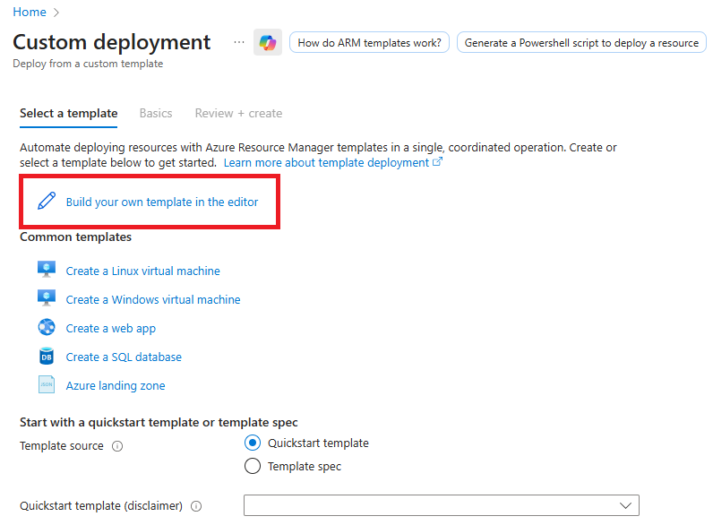
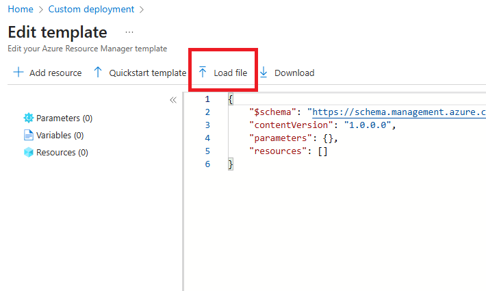

# Loggle Azure Template

The `azure/arm` folder holds the Bicep template (`loggle.bicep`) and its generated ARM JSON (`loggle.json`) that mirrors the Terraform stack under `terraform/azure`. The VM Custom Script extension clones this repository, stages the contents of `azure/vm-assets/` into `/var/cache/loggle-assets/`, downloads `install.sh` directly from GitHub based on the configured repository URL and branch, and drops a `loggle-bootstrap.service` unit that runs after `cloud-final.service` to execute the script. Operators can still inspect every asset on-disk before the installer runs.

## 1. Keep the VM assets in sync

`azure/vm-assets/` is a straight copy of the root `remote/` directory (the same payload Terraform uploads with its `file` provisioner). Whenever you touch anything under `remote/`, refresh the Azure copy before committing:

```pwsh
Remove-Item -Path azure/vm-assets -Recurse -Force -ErrorAction SilentlyContinue
New-Item -ItemType Directory -Path azure/vm-assets | Out-Null
Copy-Item -Path remote/* -Destination azure/vm-assets -Recurse -Force
```

This keeps the Azure artifacts readable in-tree and guarantees the deployment bundle always matches the Terraform provisioning logic.

## 2. Compile Bicep -> ARM JSON

Install/refresh the bundled CLI through Azure CLI (`az bicep install`). Then build the ARM template with:

```pwsh
az bicep build --file azure/arm/loggle.bicep --outfile azure/arm/loggle.json
```

This produces an Azure Resource Manager template (`azure/arm/loggle.json`) that you can distribute to consumers. **Prerequisites:** create (or select) the resource group up front and provision a public IP inside that group; the deployment only attaches to an existing IP and will not create one for you. The template exposes the following key parameters:

| Parameter | Description | Default |
|-----------|-------------|---------|
| `namePrefix` | Short prefix applied to every resource (affects VM, NIC, NSG, etc.). | `loggle` |
| `vmSize` | VM SKU. | `Standard_D2s_v3` |
| `adminUsername` | SSH admin user. | `loggle` |
| `sshPublicKey` | **Required** OpenSSH public key. | *(none)* |
| `domainName` | Hostname served by the stack and used for TLS. | `kibana.loggle.co` |
| `certificateEmail` | Let's Encrypt contact email. | `certbot@loggle.co` |
| `letsEncryptEnvironment` | Choose `production` for real certs or `staging` when testing repeatedly (avoids rate limits with test certificates). | `production` |
| `kibanaAllowedIps` | Array of CIDR ranges allowed through the NSG for HTTP/S. | `["0.0.0.0/0"]` |
| `keyVaultName` | Optional explicit Key Vault name. Leave empty to use the prefix-based pattern. | `logglekv` |
| `repositoryUrl` | Git repository that hosts the `vm-assets` folder. | `https://github.com/jgador/loggle.git` |
| `repositoryBranch` | Git branch or tag to pull from `repositoryUrl`. | `master` |
| `publicIpName` | **Required** name of the pre-created public IP that already lives in the chosen resource group. The template only attaches to this IP. | *(none)* |

> Purge protection is disabled by default so the Key Vault can be deleted (and purged) during environment teardown. Toggle it manually if your compliance posture requires it.  
> **Important:** The `publicIpName` you provide must reference an existing public IP resource inside the same resource group you deploy to; the template will fail if it cannot find that IP.  
> **Testing tip:** switch `letsEncryptEnvironment` to `staging` while iterating, then back to `production` before go-live.

Key Vault names are deterministic by default: the template lowercases the `namePrefix`, strips dashes, and appends `kv` (falling back to `kvstore` when no prefix is provided). You can override this behavior by setting the `keyVaultName` parameter, which defaults to `logglekv`.

## 3. Azure Portal deployment workflow

**Resource-group scoped (`azure/arm/loggle.json`)**

### Portal custom template quickstart
1. **Find the deployment blade.** In the Azure Portal search bar, type **template deployment** and open **Deploy a custom template**.  
   
2. **Launch the editor.** Click **Build your own template in the editor** so you can paste or upload Loggle's ARM template.  
   
3. **Upload `loggle.json`.** Use **Load file**, select `azure/arm/loggle.json` from your local clone (or any downloaded copy), then click **Save**. You should now see the parameters form for Loggle.  
   

Once the template loads:
- Select your subscription, pick an existing resource group (or create one), and complete the parameters—the SSH public key is mandatory.
- Choose **Review + create**, confirm the summary, then submit the deployment.

The deployment outputs the VM public IP, the managed identity client ID, and the Key Vault resource ID.

### Naming

Every resource name is derived from the `namePrefix` parameter (e.g., `loggle-vnet`, `loggle-nsg`). If you set `namePrefix` to an empty string, the template falls back to simple names like `vnet` and `nsg`. For per-resource overrides you now need to fork or extend the template.

### Verifying the VM bootstrap

To confirm the install script finished successfully:
1. Open the provisioned VM in the Azure Portal.
2. Under **Operations**, choose **Run command** (see [Microsoft Docs](https://learn.microsoft.com/en-us/azure/virtual-machines/linux/run-command) for background).
3. Select **RunShellScript** and execute `sudo cat /etc/loggle/install.log`.

The tail of the log should include `Loggle setup complete.` along with the container status summary printed by `install.sh`.
