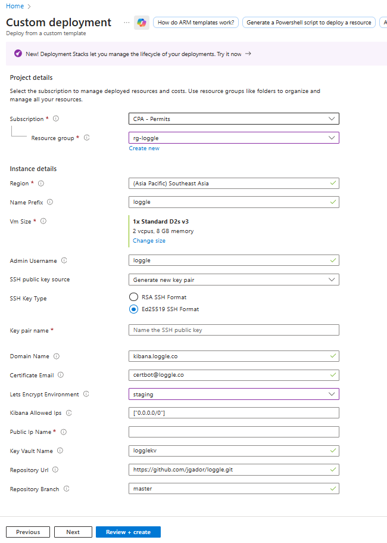

# Loggle Azure Template

To deploy Loggle on Azure, download the ready-to-use ARM template at [`azure/arm/loggle.json`](../../azure/arm/loggle.json) (generated from `loggle.bicep`), then follow the portal workflow below to upload it. The VM bootstrap logic pulls the assets from `azure/vm-assets/` and runs `install.sh` for you, so no manual provisioning steps are required.

## Azure Portal deployment workflow

**Resource-group scoped (`azure/arm/loggle.json`)**  
This ARM template is deployed at the resource group level using the Azure Portal custom template experience. It only creates resources inside that resource group and does not modify anything at the subscription or management group level.

> ⚠️ **Prerequisites before opening the template**
> - **Resource group ready:** Use the resource group that already contains your Standard static public IP. The template looks up the IP by name inside that same resource group, so creating the group at deploy-time without also pre-loading the IP will fail.
> - **Static public IP allocated:** Provision a Standard *static* public IP inside that resource group. Certbot uses this IP to issue a free TLS certificate, and the template only attaches to an existing IP.
> - **DNS A record in place:** Point your Loggle hostname (for example `logs.example.com`) to the public IP via an **A** record before you deploy. Certbot validation runs during provisioning and fails unless the DNS name already resolves to the VM’s IP.

### Portal custom template quickstart
1. **Find the deployment blade.** In the Azure Portal search bar, type **template deployment** and open **Deploy a custom template**.

   

2. **Launch the editor.** Click **Build your own template in the editor** so you can paste or upload Loggle's ARM template.

   

3. **Upload `loggle.json`.** Use **Load file**, select [`azure/arm/loggle.json`](../../azure/arm/loggle.json) from your local clone (or download it fresh), then click **Save**. You should now see the parameters form for Loggle.

   

4. **Review the parameter form.** The portal shows all parameters from `loggle.json`. Use the screenshot below to see which fields you need to fill in before you continue. The **Region** value is taken from the resource group you selected, so there’s nothing to edit there.

   

**Parameter reference**

| Azure portal label | Description | Default |
|--------------------|-------------|---------|
| Resource group | Scope for every resource the template deploys. Select the group that already contains your static public IP. | *(choose in portal)* |
| Name Prefix | Short prefix applied to every resource (affects VM, NIC, NSG, etc.). | `loggle` |
| VM size | VM SKU for the Loggle host. | `Standard_D2s_v3` |
| Admin username | SSH admin user created on the VM. | `loggle` |
| SSH public key source | Choose **Generate new key pair** if you want Azure to create one (download the private key before you leave the portal), or **Use existing public key** if you generated the key pair ahead of time with `ssh-keygen -t ed25519 -C "loggle" -f "$env:USERPROFILE\.ssh\loggle" -N ""`. | *(choose in portal)* |
| SSH public key | If you chose **Use existing public key**, paste the Ed25519 `.pub` content you generated ahead of time. Leave blank when you select **Generate new key pair** because Azure supplies the value automatically. | *(none)* |
| Domain Name | Public hostname clients use to reach Kibana with HTTPS. Certbot uses it to issue the Let's Encrypt TLS certificate, so create the DNS A record before deploying. | `kibana.example.com` |
| Certificate Email | Let's Encrypt contact email for certificate lifecycle notifications. | `certbot@example.com` |
| Let's Encrypt Environment | Choose `production` for real certs or `staging` when testing repeatedly (avoids rate limits with test certificates). | `production` |
| Kibana allowed IPs | Array of CIDR ranges allowed through the NSG for HTTPS (443). | `["0.0.0.0/0"]` |
| Key Vault name | Optional explicit Key Vault name; leave empty to use the prefix-based pattern. | `logglekv` |
| Repository URL | Git repository that hosts the VM bootstrap assets. | `https://github.com/jgador/loggle.git` |
| Repository branch | Git branch or tag pulled from the repository URL. | `master` |
| Public Ip Name | **Required** name of the pre-created public IP that already exists in the target resource group. | *(none)* |

> **Important:** The `Public Ip Name` you provide must reference an existing public IP resource inside the same resource group you deploy to; the template will fail if it cannot find that IP.  
> **Testing tip:** Switch the Let's Encrypt environment to `staging` while iterating, then back to `production` before go-live.

Once the template loads:
- Select your subscription, pick an existing resource group (or create one), and complete the parameters—fill in the SSH key fields according to the option you chose earlier.
- Choose **Review + create**, confirm the summary, then submit the deployment.

### Naming

Every resource name is derived from the `Name Prefix` parameter (e.g., `loggle-vnet`, `loggle-nsg`). If you set `namePrefix` to an empty string, the template falls back to simple names like `vnet` and `nsg`. For per-resource overrides you now need to fork or extend the template.

### Verifying the VM bootstrap

To confirm the install script finished successfully:
1. Open the provisioned VM in the Azure Portal.
2. Under **Operations**, choose **Run command** (see [Microsoft Docs](https://learn.microsoft.com/en-us/azure/virtual-machines/linux/run-command) for background).
3. Select **RunShellScript** and execute `sudo cat /etc/loggle/install.log`.

The tail of the log should include `Loggle setup complete.` along with the container status summary printed by `install.sh`.

## Keep the VM assets in sync

`azure/vm-assets/` holds the static payload that the VM downloads during provisioning (install scripts, docker-compose, collector configs, etc.). Update those files directly when you change the bootstrap logic so the ARM deployment always pulls the latest assets.

## Compile Bicep -> ARM JSON

Install/refresh the bundled CLI through Azure CLI (`az bicep install`). Then build the ARM template with:

```pwsh
az bicep build --file azure/arm/loggle.bicep --outfile azure/arm/loggle.json
```
